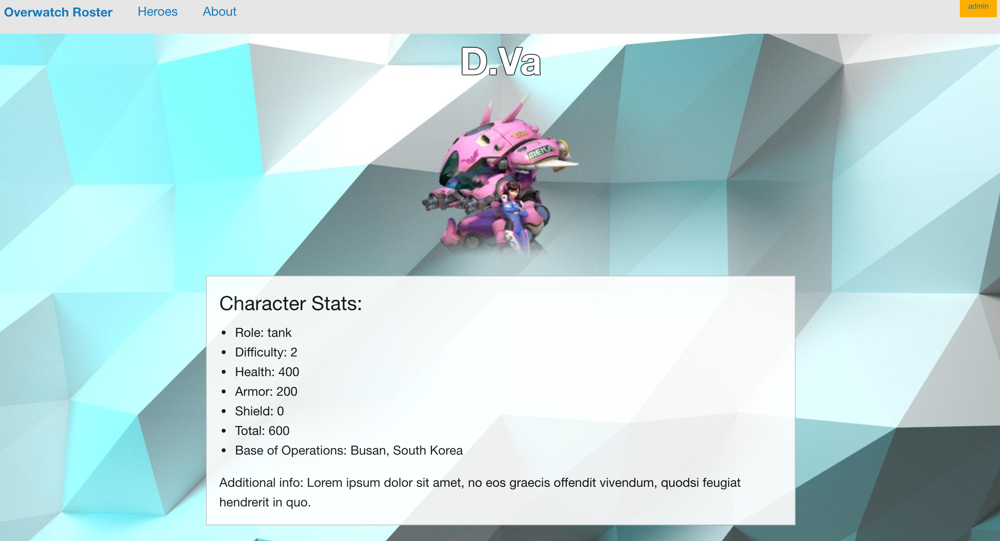

# Overwatch Character Roster

#### _Epicodus Friday Project, 5-12-2017_

This app is meant to provide the user with list of playable characters from the game _Overwatch_. Users will be able to view a list of characters, filter characters by role, and detailed pages for each individual character. The admin button will add options to add, edit and delete characters.

This project was generated with [Angular CLI](https://github.com/angular/angular-cli) version 1.0.3.

## Setup
  * Clone this repository

  * Navigate to its folder in your terminal

  * Run the commands npm install, bower init, bower install, and ng serve in that order

  * Navigate to localhost:4200 in your web browser

## License

  Copyright (c) 2017 **_Christian Martinez_**

  MIT license

## Planning

  1. Configuration/dependencies
    * Angular
    * Gulp
    * Bower
    * Foundation
    * Firebase

  2. Specs
    * User/Admin
    * Filter by specific criteria dps/tank/healing
    * Add, edit, delete.

  3. Integration
    * Character model
    * Character service
    * Character List component
    * Character detail component
    * Admin component
    * Edit component
    * Welcome component
    * Routing app
    * Role/type pipe

    4.  UX/UI
      * Foundation
      * Admin/User toggle

    5. Polish
      * Edit README
      * Dynamic page content - hide/show forms
      * Materialize
